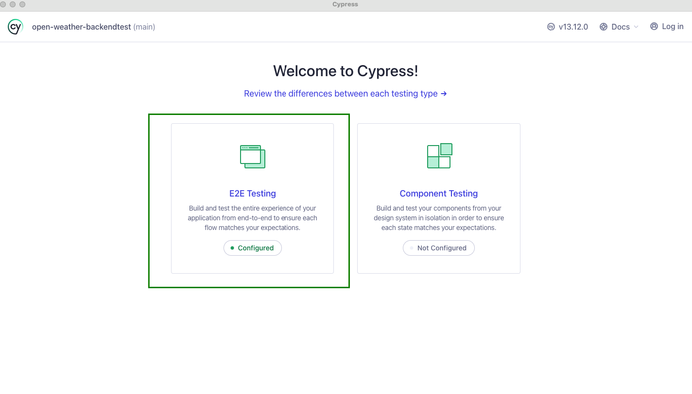
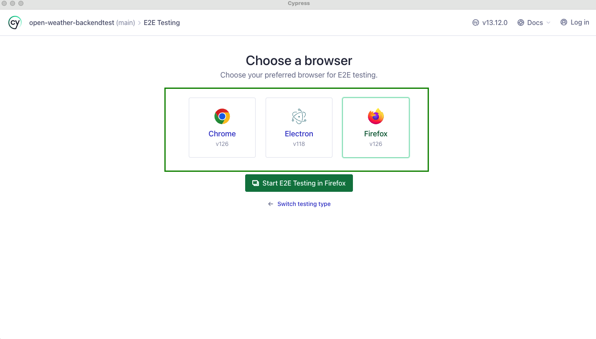
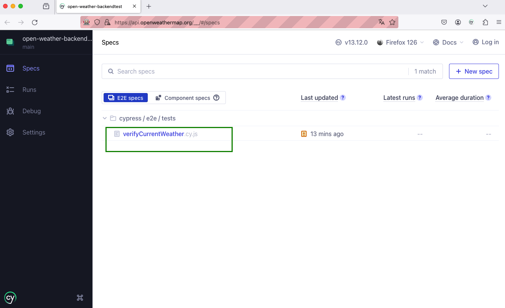
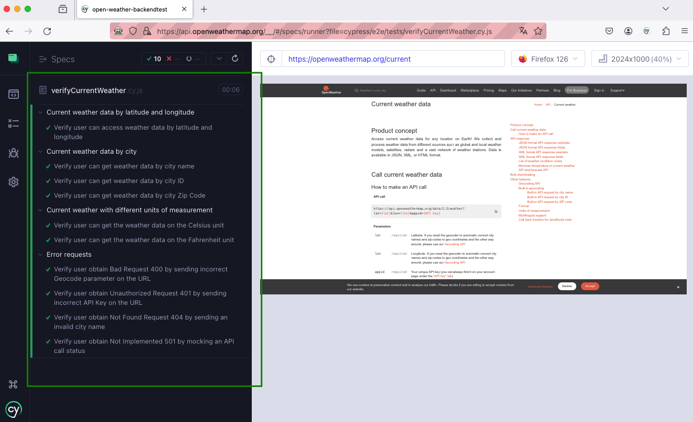

# open-weather-backendtest

👋 Hello!

# Project description
This project aims to explore the Open Weather API (https://openweathermap.org/current) by making requests to test the following functionalities:

- Current weather data by latitude and longitude;
- Current weather data by city name, city ID and zip code;
- Current weather with different units of measurement;
- Create requests to reproduce the following errors: 400, 401, 404, 5XX;
- Explain how to simulate the erro 429 (see on session below).

# Language, framework and technologies used
Cypress framework was used in this project, and the test cases were created using the JavaScript language.

# Test Cases:

The following test cases were created to cover the main API funcionalities and edge cases:

- Verify user can access weather data by latitude and longitude;
- Verify user can get weather data by city name;
- Verify user can get weather data by city ID;
- Verify user can get weather data by Zip Code;
- Verify user can get the weather data on the Celsius unit;
- Verify user can get the weather data on the Fahrenheit unit;
- Verify user obtain Bad Request 400 by sending incorrect Geocode parameter on the URL; 
- Verify user obtain Unauthorized Request 401 by sending incorrect API Key on the URL;
- Verify user obtain  Not Found Request 404 by sending an invalid city name;
- Verify user obtain Not Implemented 501 by mocking an API call status.

# How could we simulate / reproduce 429 Error?
Errors 429 are the ones that represents many requests in a given amount of time - usually  a short time. 
As this error is related to rate limit set by a server, to reproduce it we should first indentify the rate limit of the API or web service we are using. Next, we can use an application, e.g.  Jmeter, or create a code script, e.g. in JavaScript or Python, to simulate many requests that will be sent to exceed the allowed limit, paying close attention to reproduce it against a sandbox environment if available, since exceeding rate limits on production APIs can lead to some penalties, like temporary bans. 


# How to install and check the project?

A. After git clone this project to your local machine, access the project directory and do the following steps: 

1. **Install Cypress**: 
```bash
npm install cypress --save-dev
```

2. **Open Cypress on UI mode**: 
```bash
npx cypress open
```

3. **On the Welcome page**:  click on 'E2E Testing'



4. **Choose a browser**, and click on Start 'E2E Testing'



5. **Click on the test case**: the tests will start automatically





### You can also run the project on a headless mode: 

```bash
npx cypress run
```
